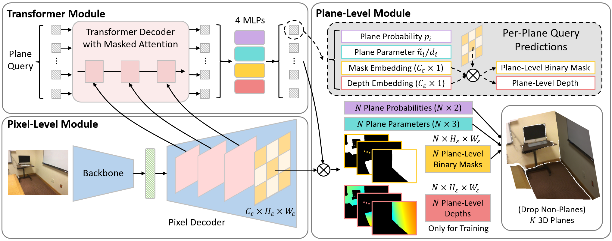

## PlaneRecTR: Unified Query Learning for 3D Plane Recovery from a Single View (ICCV 2023)

Jingjia Shi, [Shuaifeng Zhi](https://shuaifengzhi.com/), [Kai Xu](https://kevinkaixu.net/index.html)

[[`arXiv`](https://arxiv.org/abs/2307.13756)] [[`Page`](https://sjingjia.github.io/PlaneRecTR/)] [[`BibTeX`](#CitingPlaneRecTR)]


PlaneRecTR consists of three main modules: (1) A pixel-level module to extract dense  pixel-wise image features; (2) A Transformer module to jointly predict 4 plane-related properties from each plane query, including plane  classification probability, plane parameter, mask and depth embedding; (3) A plane-level module to calculate dense plane-level binary  masks/depths, then filter non-plane predictions and produce the final 3D plane recovery.


## Updates
- 2024.6: Upload the [`Inference demo`](#InferenceDemo).

## Usage Instructions
### Installation
This repository requires Python 3.7 and makes use of several external libraries (e.g., pytorch, detectron2). The script below is an example conda environment setup.

```bash
# 1.Create a conda environment.
conda create --name planerectr python=3.7
conda activate planerectr

# 2. Install Pytorch. Note, Please refer to https://pytorch.org/get-started/locally/ to select the appropriate version. 
pip install torch==1.10.1+cu113 torchvision==0.11.2+cu113 torchaudio==0.10.1+cu113 -f https://download.pytorch.org/whl/cu113/torch_stable.html

# 3. Install dependencies.
pip install -r requirements.txt

# 4. Install Detectron2. Note, please check PyTorch version matches that is required by Detectron2.
git clone -b v0.6 git@github.com:facebookresearch/detectron2.git
cd detectron2
pip install -e .

# 5. compile CUDA kernel for MSDeformAttn
cd PlaneRecTR/modeling/pixel_decoder/ops
sh make.sh
```

### Data preparation
Follow [Mask2Former](https://github.com/facebookresearch/Mask2Former), all datasets are placed in the directory specified by the environment variable `DETECTRON2_DATASETS`. you can set the location for builtin datasets by `export DETECTRON2_DATASETS=YOUR_DATASETS_FOLDER/`, and then detectron2 will look for datasets in the following directory structure:
```
$DETECTRON2_DATASETS/
  scannetv1_plane/
  nyuv2_plane/
```
If left unset, the default is `./datasets` relative to your current working directory.

##### 1) ScanNetv1-Plane
Please download tfrecords data from [PlaneNet](https://github.com/art-programmer/PlaneNet), then run the following commands to convert it to npz data and generate json files required by [detectron2](https://github.com/facebookresearch/detectron2):
```bash
# YOUR_DOWNLOADED_TFRECORDS_FOLDER: folder to host tfrecords files of PlaneNet.
python tools/generate_scannetv1_plane_dataset.py --input-folder YOUR_DOWNLOADED_TFRECORDS_FOLDER/ --output-folder $DETECTRON2_DATASETS
```

<!-- Change line 113 of ./PlaneRecTR/data/datasets/register_scannetv1_plane.py as follows:
```python
_root = "[YOUR_OUTPUT_FOLDER]"
``` -->
##### 2) NYUv2-Plane
Please download NYUv2-Plane dataset generated by [PlaneAE](https://github.com/svip-lab/PlanarReconstruction) from [here](https://drive.google.com/open?id=1WxmpmZzD5TazozizzIVE31jsVgvJAiRu) and original NYUv2 data from [here](http://horatio.cs.nyu.edu/mit/silberman/nyu_depth_v2/nyu_depth_v2_labeled.mat) and [here](http://horatio.cs.nyu.edu/mit/silberman/indoor_seg_sup/splits.mat). The structure of the data folder should be:
```bash
YOUR_DOWNLOADED_NYUv2_FOLDER/
  nyu_depth_v2_plane_gt/ # from PlaneAE
    *.png
    *.npz
  nyu_depth_v2_labeled.mat # original NYUv2 data
  splits.mat # original NYUv2 data
```
Run the following command to process the downloaded files and generate the json file required by [detectron2](https://github.com/facebookresearch/detectron2):
```bash
python tools/generate_nyuv2_plane_dataset.py --input-folder YOUR_DOWNLOADED_NYUv2_FOLDER/ --output-folder $DETECTRON2_DATASETS
```
### Training
Please choose one of pretrained backbone models (ResNet-50, HRNet-32, Swin-B) from [here](https://drive.google.com/drive/folders/1kDRVGpNp1EkCLW7b77h4pEE5N4IfhKxc?usp=sharing) and place it under the 'checkpoint/' folder. you can simply run the following commands to train on the ScanNet dataset with the corresponding config file:
```bash
# ResNet-50:
python train_net.py --num-gpus 1 --config-file configs/PlaneRecTRScanNetV1/PlaneRecTR_R50_bs16_50ep.yaml
# HRNet-32: 
python train_net.py --num-gpus 1 --config-file configs/PlaneRecTRScanNetV1/hrnet/PlaneRecTR_hrnet_w32_imagenet_pretrained.yaml
# Swin-B: 
python train_net.py --num-gpus 1 --config-file configs/PlaneRecTRScanNetV1/swin/PlaneRecTR_swin_base_384_bs16_50ep.yaml
```

### Evaluation
Please first download our trained models from [here](https://drive.google.com/drive/folders/138Jpu5YChOKhmMpYoTUHZHH9NRZBngnF?usp=sharing) and place them under the 'checkpoint/' folder. Run the following commands to evaluate on the ScanNetv1-Plane and NYUv2-Plane datasets:
```bash
# PlaneRecTR (ResNet-50): 
python train_net.py --eval-only --num-gpus 1 --config-file configs/{PlaneRecTRScanNetV1, PlaneRecTRNYUV2}/PlaneRecTR_R50_bs16_50ep.yaml MODEL.WEIGHTS checkpoint/PlaneRecTR_r50_pretrained.pth
# PlaneRecTR (HRNet-32):
python train_net.py --eval-only --num-gpus 1 --config-file configs/{PlaneRecTRScanNetV1, PlaneRecTRNYUV2}/hrnet/PlaneRecTR_hrnet_w32_imagenet_pretrained.yaml MODEL.WEIGHTS checkpoint/PlaneRecTR_hrnet32_pretrained.pth
# PlaneRecTR (Swin-B): 
python train_net.py --eval-only --num-gpus 1 --config-file configs/{PlaneRecTRScanNetV1, PlaneRecTRNYUV2}/swin/PlaneRecTR_swin_base_384_bs16_50ep.yaml MODEL.WEIGHTS checkpoint/PlaneRecTR_swinb_pretrained.pth 
```


### <a name="InferenceDemo"></a>Inference demo
During inference, PLANE_MASK_THRESHOLD in config file can be modified to adjust segmentation for unseen scene. Based on the input, modify the camera K (--fx, --fy, --ox, --oy) and original image size (--original-w, --original-h).
```bash
# PlaneRecTR (ResNet-50): 
python demo/demo.py --config-file configs/PlaneRecTRScanNetV1/PlaneRecTR_R50_demo.yaml --input demo/359_d2_image.png --output demo/test_result/ --fx 517.97 --fy 517.97 --ox 320 --oy 240
```


## <a name="CitingPlaneRecTR"></a>Citing PlaneRecTR

If you use PlaneRecTR in your research, please use the following BibTeX entry.

```BibTeX
@InProceedings{shi2023planerectr,
  author={Shi, Jingjia and Zhi, Shuaifeng and Xu, Kai},
  title={PlaneRecTR: Unified Query Learning for 3D Plane Recovery from a Single View}, 
  booktitle={ICCV},
  year={2023}
}
```

## Ackownledgements
PlaneRecTR is built on top of these great works: [mask2former](https://github.com/facebookresearch/Mask2Former), [planeTR](https://github.com/IceTTTb/PlaneTR3D), [planeAE](https://github.com/svip-lab/PlanarReconstruction), and [planeNet](https://github.com/art-programmer/PlaneNet).

